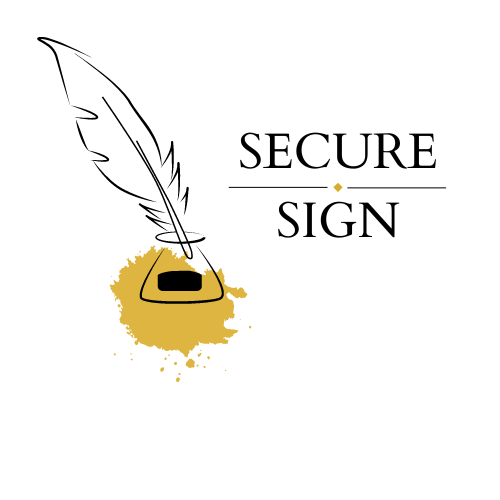

    

SecureSign

###

SecureSign is a prototype web3 implementation of esignature collection built on Mantle smart contracts and IPFS.

Enables Docusign-like capabilities / use-cases using web3 infrastructure.

### Benefits

- SecureSign enables anyone to create and collect esignature against documents without a vendor agreement. A mantle smart contract is deployed for each request.
- Each packet of documents for esignature is made accessible at an IPFS url.
- When the esignature is completed, an NFT is generated that links both the signer's signature and the documents being agreed on.
- Signer can only sign the documents they are intended to after they give proof of humanity.
- Hosted documents and the request are immutable.
- Smart contract deployed on Mantle which marks the progress/fulfillment of the esignature request. The contract can only be marked completed by the designated signer address at time of final signature.
- View history of requests and completed esignatures using the knowYourCatId and covalent chain history API directly from the app.
- An individual in the context of the SecureSign application is the pairing of a canvas (handwritten) signature and wallet signature/address.

### Technologies used

- Mantle: In-app deployment of the request smart contract and marked completed upon completion of the each request based on receival of signer's signature. A new Mantle contract is deployed for each new esignature request.
- zk.me: Enabled proof of humanity by using Anti-Sybil SDK of zk.me.
- nft.storage: Generation of the esignature record / proof. Attaches the final esignature/agreement to an NFT and saves a link to it in the smart contract.
- web3.storage: for storing files(aggrements).
- KnowYourCat: To make minted NFT into a CAT-agory so that its information can be fetched with ease.

